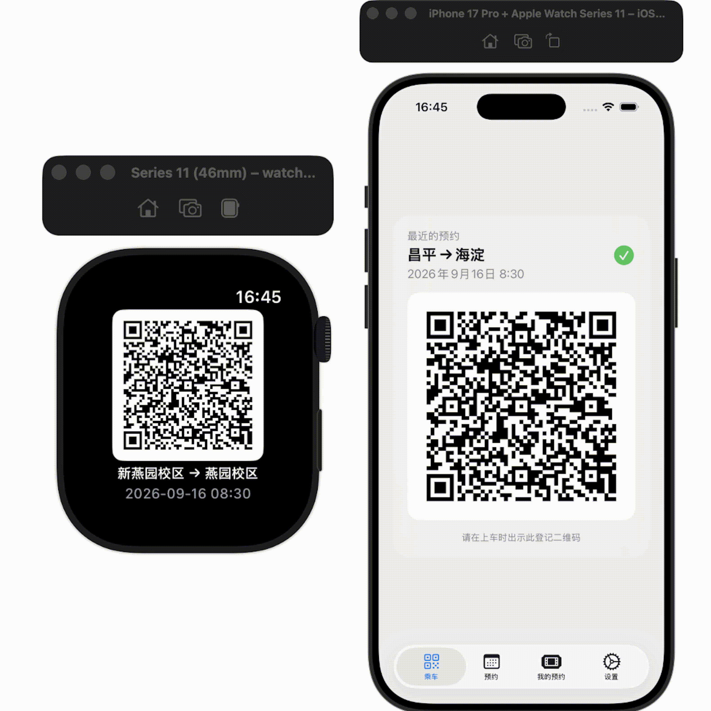

# iShuttle

北京大学新燕园校区班车预约 iOS 应用。

本项目参考了 [Marchkov-Helper](https://github.com/VariantConst/Marchkov-Helper)。

## 核心功能

- 首页查看最近预约的乘车二维码
- 定位所在校区并自动选择班车方向
- 支持展示任意已预约的乘车二维码
- 将预约二维码同步到 Apple Watch，抬腕即可出示
- 适配深色模式

## 使用演示

